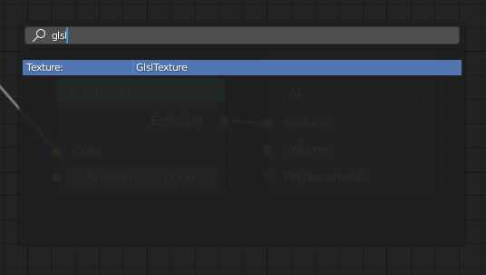
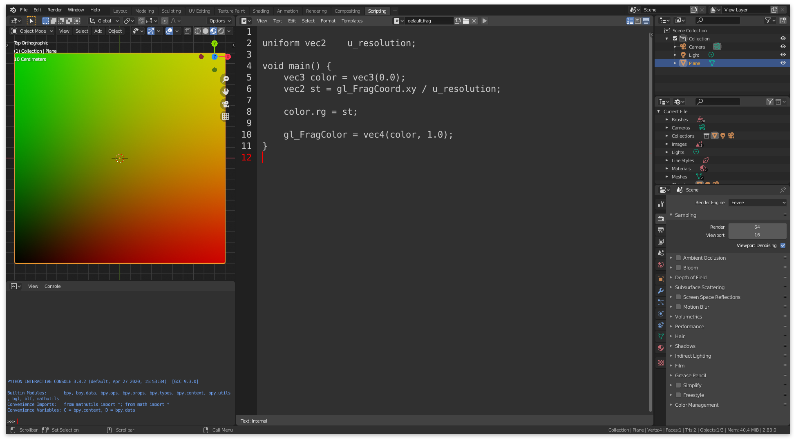

Create textures from Glsl fragment shaders on Blender 2.8+

# Install

// TODO

# Use

1. Operator Search: `F3` (or `SpaceBar` depending on your setup). Type `GlslTexture`

2. Change `width` and `height` size and `Source` file (which can be a path to an external file). 

3. Use the Image on your materials. The Image name will be based on the name of the source file.

4. Go to the Text Editor (or an external editor if your source file is external) and edit the shader. It will hot reload.

The uniform specs will be the same that: 

* [The Book of Shaders](https://thebookofshaders.com/): gentel guide into shaders
* [glslCanvas](https://github.com/patriciogonzalezvivo/glslCanvas/): Js/WebGL
* [glslEditor](https://github.com/patriciogonzalezvivo/glslEditor/): Js/WebGL/Electron editor
* [glslViewer](https://github.com/patriciogonzalezvivo/glslViewer): C++/OpenGL ES 2.0 native app for win/osx/linux/raspberry pi 
* [ofxshader](https://github.com/patriciogonzalezvivo/ofxShader/): Openframeworks addon 
* [vscode-glsl-canvas](https://marketplace.visualstudio.com/items?itemName=circledev.glsl-canvas): live WebGL preview of GLSL shaders for VSCode made by [Luca Zampetti](https://twitter.com/actarian)
* [shader-doodle](https://github.com/halvves/shader-doodle): A friendly web-component for writing and rendering shaders made by [@halvves](https://twitter.com/halvves)

So far the supported uniforms are:

* `uniform vec2 u_resolution;`: 2D vector with the width and height of the target texture  